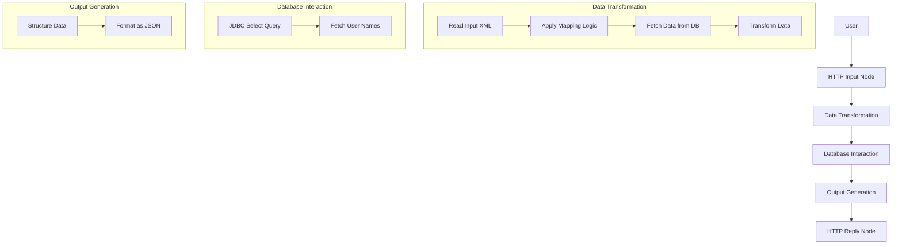

# simple-ibm

## REST API Flow Diagram

```mermaid
graph TD
A[User] --> B[HTTP Input Node]
B --> C[Data Transformation]
C --> D[Database Interaction]
D --> E[Output Generation]
E --> F[HTTP Reply Node]

subgraph Data Transformation
C1[Read Input XML] --> C2[Apply Mapping Logic]
C2 --> C3[Fetch Data from DB]
C3 --> C4[Transform Data]
end

subgraph Database Interaction
D1[JDBC Select Query] --> D2[Fetch User Names]
end

subgraph Output Generation
E1[Structure Data] --> E2[Format as JSON]
end
```